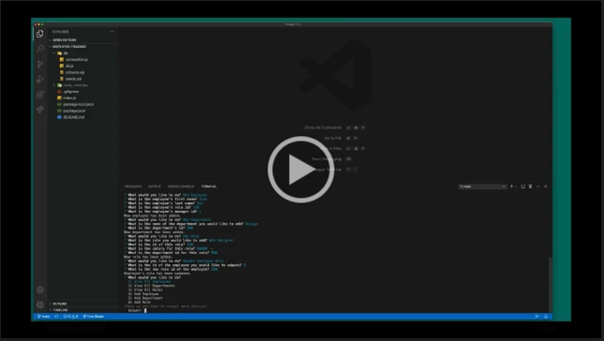

# Employee Tracker

  ## Description

  A command-line application that manages a company's employees using node, inquirer, and MySQL. The app allows users to view and add departments, roles, employees as well as update employee roles.

  ## Installation

  To install necessary dependencies, run the following command:

  ```md
  npm i
  ```

  ## Usage

  Open the integrated terminal. Run node index.js. Select a Task you would like to perform. Answer questions when prompted. Below is a walkthrough video that demonstrates how a user would invoke the application from the command line and enter responses to the prompts.

  <a href="https://drive.google.com/file/d/1RBC25PzA3jgDJIvdLNZr0lh28-p0iLBZ/view"></a><br>
  [Walkthrough Video Link](https://drive.google.com/file/d/1RBC25PzA3jgDJIvdLNZr0lh28-p0iLBZ/view)
